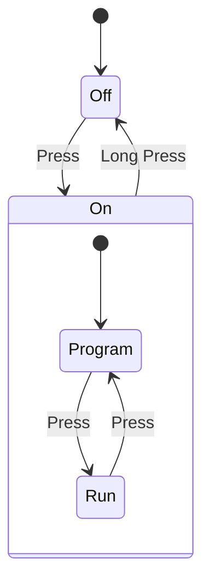

# LEGO
MircoPython scripts for LEGO hubs using [pybricks](https://pybricks.com) framework.

## Hub Mode
Hub internal mode's state diagram.

- Off
- Program mode
- Running mode

## Projects

- [Audi RS Q e-tron](/42160)

